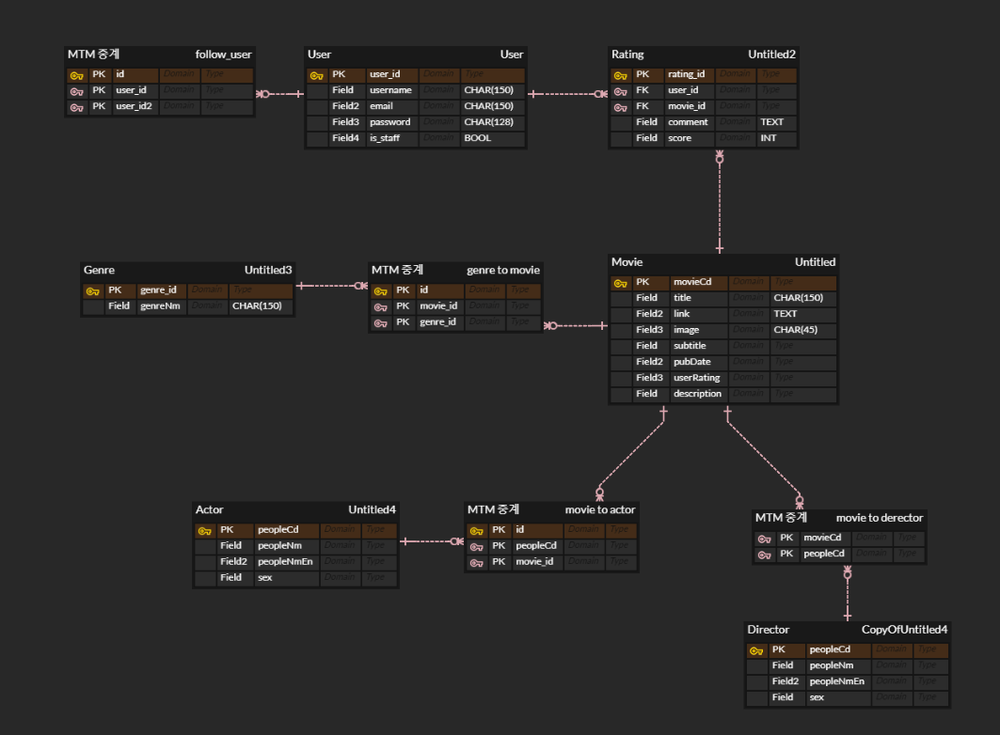

# Final Project 

[일자별 업무 진행](#일자별-업무-진행), [규칙](#규칙), [극복](#극복)

## 목표 

- 영화 배우 기반 영화 추천.

- 다시보기 플랫폼 추천.


## 개발 환경

|           | Languaes   | FrameWork                                                    |
| --------- | ---------- | ------------------------------------------------------------ |
| Front-end | Python     | [Django (djangorestframework)](https://www.django-rest-framework.org/) |
| Back-end  | Javascript | [Vue.JS](https://kr.vuejs.org/v2/guide/index.html) , [Vutify](https://vuetifyjs.com/ko/) |

- 웹 Django REST API 서버를 구축. 


## 구조도

### A. ERD




### B. Data Base

400개의 seed data


## 규칙

- 데이터베이스는 gitignore 할 것. (fixtures만 업로드 하도록)

  

## 일자별 업무 진행

|       | 병철                                                         | 수진                                                         |
| ----- | ------------------------------------------------------------ | ------------------------------------------------------------ |
| 11.21 | Youtube 영화 다시보기 정보 크롤링                            | naver Series 에서 영화 다시보기 정보 (가격) 크롤링           |
| 11.22 | Youtube 영화 다시보기 정보(제목, 링크, 가격) 크롤링<br />Model 빌드(ERD로 표현) <br />DRF를 이용해 API 서버 만들기Create, Read, Delete<br /> | naver Series 에서 영화 다시보기 정보 (제목, 링크) 크롤링, <br />영진위에서 [영화정보 크롤링](#영화정보-크롤링)<br />Seed data인 ixtures/movies.json, genres.json 만들기 |
| 11.25 |                                                              | [django 서버로 API요청](#django-서버로-API요청), 영화 리스트 응답 받아서 vue에 띄우기(`MovieList.vue`) |


## 극복


### 영화정보 크롤링

[영진위](http://www.kobis.or.kr/kobisopenapi/homepg/main/main.do)에서 지금부터 52주간의 영화 이름을 받아오는중, 

dictionary를 json으로 저장하는 과정에서 인코딩 문제가 발생.

```python
with open('movies_name.json', 'w', encoding='UTF-8') as fp:
    json.dump(movies_name, fp, ensure_ascii=False)
```

`encoding='UTF-8'` , `ensure_ascii=False`  추가로 해결. 


### django 서버로 API요청

첫 번째, URL 오류

```javascript
const MOVIE_URL = 'localhost:8000/api/v1/movies/' //(x)
const MOVIE_URL = 'http://127.0.0.1:8000/api/v1/movies/' //(O)
```


두  번째, 인증 오류 (401 (Unauthorized))

django에서 로그인 된 사용자만 영화 리스트를 제공하도록 설계 했기 때문.

=> API 요청시 세션에서 로그인 정보를 찾아 (jwt 형식으로) 함께 보내준다. 

```javascript
const token = this.$session.get('jwt')
const options = {
    headers: {
        Authorization: 'JWT ' + token
    }
}    
axios.get(MOVIE_URL, options)
    .then(res=>{
    this.movies = res.data 
})
```

